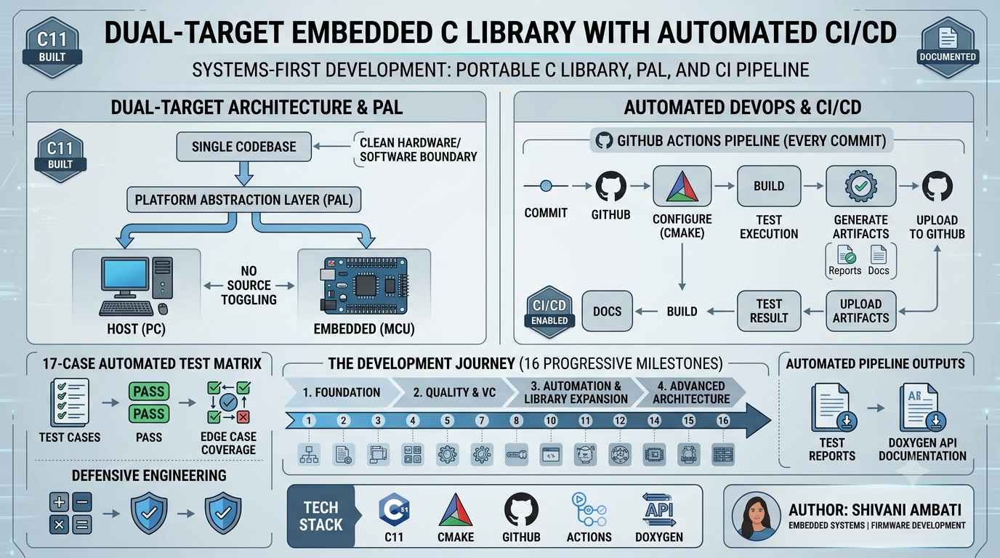

# Dual-Target Embedded C Library with Automated GitHub Actions CI/CD

<p align="center">


</p>

<p align="center">
  
</p>

## Core Architectural Features

- **Platform Abstraction Layer (PAL)** — Clean hardware/software boundary isolating host (GCC/PC) and embedded (simulated MCU firmware) implementations under a unified public API, enabling zero-change portability across targets.
- **Conditional Cross-Compilation** — CMake `-DTARGET_PLATFORM=HOST|EMBEDDED` flag drives compile-time target selection; no manual source toggling, no linker hacks.
- **Defensive Engineering** — Edge-case-hardened Math API with explicit divide-by-zero guards, integer overflow protection, and boundary validation baked into the library core.
- **17-Case Automated Test Matrix** — Custom lightweight unit testing framework exercising normal paths, boundary conditions, and fault injection across all public API surfaces.
- **Dual Automated Artifact Pipeline** — GitHub Actions workflow generates and uploads Doxygen HTML documentation and structured test reports as downloadable CI artifacts on every push.
- **Modular Header/Implementation Separation** — Enforced `include/` vs `src/` discipline with header guards and a stable, versioned public API interface from Milestone 1.

---

## Tech Stack & Components

| Category | Item | Role |
|---|---|---|
| **Language** | C11 | Core library, PAL, unit tests, firmware engine |
| **Build System** | CMake 3.x | Multi-target configuration, flag injection, artifact orchestration |
| **CI/CD Platform** | GitHub Actions | Automated build, test execution, artifact upload |
| **Documentation** | Doxygen | API doc generation from annotated source headers |
| **Compiler (Host)** | GCC / MSBuild | Native HOST target compilation and test execution |
| **Compiler (Embedded)** | Cross-compilation toolchain | EMBEDDED target binary generation |
| **Version Control** | Git / GitHub | Branch hygiene, remote tracking, workflow triggers |
| | | |
| **Paradigm** | Platform Abstraction Layer (PAL) | Hardware/firmware decoupling via conditional compilation |
| **Paradigm** | Defensive Programming | Fault injection guards, edge-case validation, safe math contracts |
| **Paradigm** | Modular Library Architecture | Separated public API, implementation, and platform layers |
| **Paradigm** | Test-Driven Validation | Custom unit framework with 17-point regression matrix |
| **Paradigm** | Infrastructure-as-Code | CI pipeline defined in version-controlled YAML workflow files |

---

## Project Structure

```
dual-target-embedded-lib/
│
├── include/              # Public API header interfaces — stable contracts for consumers
│   └── math_lib.h        #   Versioned, guard-protected function declarations
│
├── src/                  # Core library implementation — platform-agnostic logic
│   └── math_lib.c        #   Defensive math operations with edge-case safety
│
├── platform/             # Platform Abstraction Layer (PAL) — the hardware/software boundary
│   ├── host/             #   PC/Desktop implementation (GCC, standard I/O, native runtime)
│   └── embedded/         #   MCU/simulated firmware engine (bare-metal patterns, no OS)
│
├── examples/             # Runnable demo applications for HOST and EMBEDDED build targets
│
├── tests/                # 17-case automated unit test suite (custom framework, no dependencies)
│
├── reports/              # Auto-generated test execution artifacts (CI-uploaded)
│
├── docs/                 # Doxygen configuration (Doxyfile) and generated HTML API output
│
└── .github/
    └── workflows/        # GitHub Actions YAML — build, test, and artifact pipeline definitions
```

---

## The Development Journey — 16-Stage Engineering Evolution

### Phase 1 — Foundation: Modular C Architecture *(Milestones 1–4)*

| Milestone | Deliverable |
|---|---|
| 1 | Modular C project with separated source and logic units |
| 2 | Public API header interfaces with full header guard enforcement |
| 3 | CMake migration — replaced ad-hoc compilation with structured build system |
| 4 | HOST build verification — confirmed native GCC compilation and runtime correctness |

**What Was Built:** Established the architectural skeleton every subsequent phase relies on — isolated `include/`, `src/`, and build system layers with a clean, stable public interface from day one.

**Why It Matters:** In production embedded systems, a poorly structured foundation collapses under hardware-specific divergence. This phase enforced the discipline of a stable API contract before a single line of platform-specific code was written.

**Skills Demonstrated:** `Modular C design` · `CMake project configuration` · `Header guard idioms` · `Compiler toolchain integration`

---

### Phase 2 — Quality & Version Control *(Milestones 5–7)*

| Milestone | Deliverable |
|---|---|
| 5 | Custom lightweight unit testing framework — zero external dependencies |
| 6 | Git hygiene enforcement — branch strategy, atomic commits, `.gitignore` discipline |
| 7 | GitHub remote tracking — upstream sync, push/pull workflows, CI readiness |

**What Was Built:** A self-contained validation layer and a clean version-control baseline. The custom test framework executes against the public API with no third-party test runner required.

**Why It Matters:** Embedded targets often cannot support heavyweight test frameworks (GoogleTest, CUnit). Building a minimal, portable harness mirrors real firmware validation constraints where you own the full toolchain.

**Skills Demonstrated:** `Custom test harness design` · `Git branch hygiene` · `Remote repository management` · `Regression baseline establishment`

---

### Phase 3 — Automation & Library Expansion *(Milestones 8–12)*

| Milestone | Deliverable |
|---|---|
| 8 | GitHub Actions CI integration — automated build triggered on every push |
| 9 | Multi-target pipeline infrastructure — parallel HOST and EMBEDDED build paths |
| 10 | Math API expansion — extended operation set with arithmetic safety contracts |
| 11 | Divide-by-zero and edge-case defensive guards embedded in library core |
| 12 | Exhaustive 17-case validation matrix covering normal, boundary, and fault paths |

**What Was Built:** A fully automated build-and-test pipeline, an expanded library surface, and a comprehensive regression suite. The 17-case matrix exercises every API entry point under normal conditions, boundary inputs, and injected faults.

**Why It Matters:** CI automation eliminates human-gated quality gates. Defensive math guards reflect production firmware standards where undefined behavior (integer overflow, division by zero) can corrupt MCU state or trigger hardware faults.

**Skills Demonstrated:** `GitHub Actions YAML authoring` · `Multi-target CI configuration` · `Defensive programming` · `Edge-case test matrix design`

---

### Phase 4 — Advanced Architecture & Automated Reporting *(Milestones 13–16)*

| Milestone | Deliverable |
|---|---|
| 13 | Platform Abstraction Layer (PAL) — `platform/host/` and `platform/embedded/` implementations |
| 14 | CMake `-DTARGET_PLATFORM=HOST\|EMBEDDED` conditional compilation flag |
| 15 | Simulated embedded firmware engine — bare-metal patterns without physical hardware |
| 16 | Automated Doxygen HTML generation and test artifact upload via CI pipeline |

**What Was Built:** The complete dual-target architecture. A single codebase compiles to two distinct targets using CMake flag injection. The PAL cleanly separates hardware-touching code from portable library logic. CI auto-generates and publishes API documentation and test reports.

**Why It Matters:** PAL-based design is the standard pattern in production embedded software (used in AUTOSAR, Zephyr RTOS, and HAL layers across major MCU vendors). Firmware simulation enables development and CI validation without physical hardware — a critical capability in real embedded engineering workflows.

**Skills Demonstrated:** `Platform Abstraction Layer design` · `Conditional compilation architecture` · `Firmware simulation` · `Doxygen API documentation` · `CI artifact pipeline automation`

---

## Compilation & Build Guide

### Prerequisites

- CMake ≥ 3.10
- GCC (HOST) or a configured cross-compilation toolchain (EMBEDDED)
- Git

### Clone the Repository

```bash
git clone https://github.com/<your-username>/dual-target-embedded-lib.git
cd dual-target-embedded-lib
```

### Build for HOST (PC / Desktop)

```bash
mkdir build-host && cd build-host
cmake .. -DTARGET_PLATFORM=HOST
cmake --build .
```

### Build for EMBEDDED (Simulated Firmware Target)

```bash
mkdir build-embedded && cd build-embedded
cmake .. -DTARGET_PLATFORM=EMBEDDED
cmake --build .
```

### Run the Test Suite

```bash
# From within your build directory
./tests/run_tests
```

> Test results are written to `reports/` and uploaded automatically as CI artifacts on every pipeline execution.

---

## CI/CD Workflow & Automated Reports

The GitHub Actions pipeline defined in `.github/workflows/` executes the following sequence on every push and pull request:

```
Push / PR Trigger
       │
       ▼
┌─────────────────────────────────────┐
│  1. Checkout Repository             │
│  2. Configure CMake (HOST target)   │
│  3. Build Library + Test Binary     │
│  4. Execute 17-Case Test Matrix     │
│  5. Generate Test Report Artifact   │
│  6. Run Doxygen (HTML API Docs)     │
│  7. Upload Doxygen Artifact         │
└─────────────────────────────────────┘
```

**Pipeline Outputs (downloadable from GitHub Actions → Artifacts):**

| Artifact | Contents |
|---|---|
| `test-report` | Structured output of all 17 test case results — pass/fail with diagnostics |
| `doxygen-html` | Full API documentation generated from annotated source headers |

> Both artifacts are retained per workflow run, enabling historical traceability of test results and documentation across every commit.

---

## Future Roadmap

- [ ] **Low-Level Hardware Drivers** — UART, GPIO, SPI, I2C peripheral abstractions targeting real MCU register maps
- [ ] **Circular Queue / Ring Buffer** — Lock-safe, fixed-size data structure for interrupt-driven data buffering
- [ ] **Custom Bare-Metal Bootloader** — Stage-0 firmware loader with memory map configuration and application jump logic
- [ ] **RTOS Integration** — FreeRTOS-based multithreaded embedded application with task scheduling and inter-task communication

---

## Author

**Shivani Ambati**

*Embedded Systems · Embedded C · Firmware Development · Software Engineering*

[](https://www.linkedin.com/in/shivani-ambati-268a56288/)

---

*Built with a systems-first mindset — every architectural decision in this repository reflects production embedded engineering standards.*